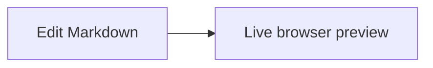

# My personal neovim configuration

To start anywhere:

```sh
nix run --refresh github:FausztBenedek/nvim-flake
```

The only requirement is nix to be installed

- `--refresh` always checks wether new changes were pushed to the repo

# Markdown preview

In a Markdown buffer, press **Space → m → p** (`<leader>mp`) to toggle a live
preview in your default browser. It updates as you edit and supports Mermaid
fenced code blocks, for example:



You can also use `:MarkdownPreview` and `:MarkdownPreviewStop`.
The plugin and its Node.js runtime are supplied by Nix; restart via `nix run .`
(or re-enter `nix develop .#dev`) after updating this configuration.

# Debugging

`<leader>d` is the debugger prefix (`db` breakpoint, `dc` continue, `di`/`do`/`dO` step,
`de` evaluate, `du` toggle UI). Tests are debugged from the neotest prefix instead:
`<leader>td` for the nearest test, `<leader>tD` for the whole file.

Generic configurations (`file`, `file:args`, `module:args`, `attach`) are always available,
so any project is debuggable without setup. debugpy itself comes from nix — projects never
need it installed. The code being debugged runs under the project's own virtualenv, found by
searching upward from the cwd for `.venv`/`venv`/`env`/`.env`.

For a project that needs a fixed invocation, put a `launch.json` at the **git root** — not in
the package directory:

```json
{
  "version": "0.2.0",
  "configurations": [
    {
      "name": "mtext_validator (Common-T)",
      "type": "python",
      "request": "launch",
      "module": "mtext_validator",
      "cwd": "${workspaceFolder}",
      "env": { "PYTHONPATH": "tools" },
      "justMyCode": false,
      "args": [
        "--schema", "Common-T/Datenmodelle/mtext-schema.xsd",
        "--mapping", "Common-T/Mappings/printHeader.mapping",
        "--datamodel-root", ".",
        "--waivers", "Common-T/Datenmodelle/known-deviations.json"
      ]
    }
  ]
}
```

`.vscode/launch.json` is re-read on every launch, so edits take effect without restarting.
Note that unlike stock nvim-dap, `${workspaceFolder}` resolves to the **git root** rather
than the cwd, and `cwd` defaults to the git root when omitted. That way opening a
subdirectory (`nvim myproject/tools`) still debugs the project correctly.

# Development

To start up an isolated environment, in order to see, if all dependencies are
installed correctly.

```sh
nix develop --ignore-environment
```
